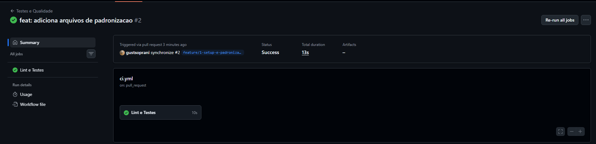
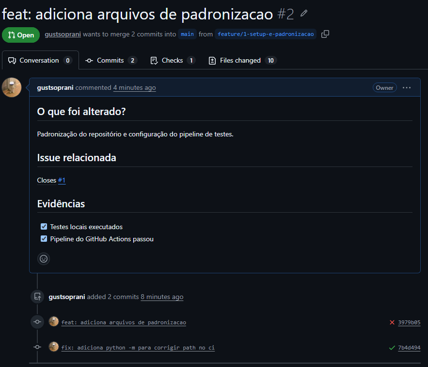
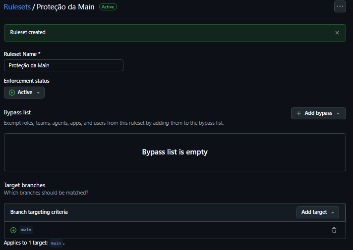

Padronização de Repositório LEDS

Projeto para aplicar os padrões técnicos de repositório, CI e testes exigidos na atividade

Como instalar e rodar

1. Instale as dependências:
```bash
pip install -r requirements.txt
```

2. Rode os testes para ver a cobertura:
```bash
pytest --verbose --cov=src --cov-fail-under=70
```

Relatório Técnico

O que foi feito:
Organizei a estrutura de pastas, criei os arquivos de exclusão ".gitignore" e ".dockerignore", fiz o ".env.example" para servir de molde, coloquei o "CODEOWNERS" e o template de PR. Também ativei o workflow do Actions para rodar os testes.

Riscos que foram corrigidos:
- Segredos vazando: o ".env" está bloqueado no ".gitignore".
- Código quebrado na main: a proteção de branch agora exige o CI verde pra aceitar o código.
- PR vazio: o template obriga a preencher o que foi feito.

Respostas da atividade:
1. Qual é a branch estável? A branch "main".
2. Qual branch recebe integração? As branches tipo "feature/" ou "fix/" que depois enviamos pra main por PR.
3. Quais verificações impedem merge? O check do Actions. Se der erro no pytest ou a cobertura ficar abaixo de 70%, o merge trava.
4. Quem revisa? O usuário que foi definido no arquivo "CODEOWNERS".
5. Como evitar commit de secrets? Barrando os arquivos reais no ".gitignore" e ".dockerignore", e subindo só o ".env.example" com dados de teste.
6. Quais evidências comprovam que foi testado? O check verde do Actions e as marcações lá no PR.
7. Como reverter alteração problemática? Pelo próprio GitHub, usando o botão de revert no PR que foi mergeado.

## Evidências

Execução do pipeline com sucesso na aba Actions:


Pull request feito e vinculado com a issue:


Proteção de branch ativada na main:
